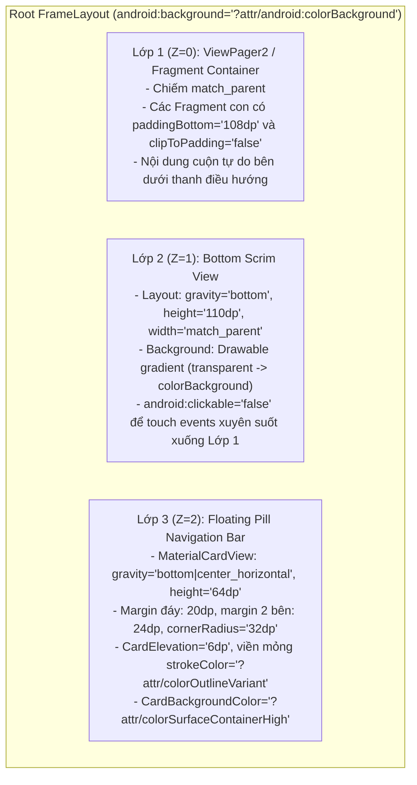

# Thiết Kế Kỹ Thuật: Giao Diện Material 3 Edge-to-Edge Với Floating Pill Navigation Bar & Bottom Scrim Cho SMAPILoader

- **Ngày tạo**: 2026-09-25
- **Trạng thái**: Đã thống nhất thiết kế (Approved)
- **Tác giả**: DeepMind Pair Programmer & Seven Nguyen
- **Repository**: [7binh/SMAPILoader](https://github.com/7binh/SMAPILoader)

---

## 1. Tổng Quan & Mục Tiêu

Tái cấu trúc và hiện đại hóa toàn diện giao diện SMAPILoader trên Android theo ngôn ngữ thiết kế **Material 3 Expressive**.
Trọng tâm là trải nghiệm tràn viền (**Edge-to-Edge**) với thanh điều hướng nổi dạng "viên thuốc" (**Floating Pill Navigation Bar**) kết hợp lớp phủ mờ chuyển sắc đáy màn hình (**Bottom Scrim / Gradient Fade**), mang lại giao diện trực quan, mượt mà và cao cấp.

### Mục tiêu chính
1. **Kiến trúc Single-Activity**: Chuyển đổi từ cơ chế swap activity rời rạc sang một container hợp nhất (`LauncherActivity`) quản lý 3 Fragment thông qua `ViewPager2` hoặc `FragmentContainerView`.
2. **Trải nghiệm Edge-to-Edge**: Toàn bộ nội dung cuộn luồn xuống dưới thanh điều hướng và đáy màn hình, được làm mờ nhẹ nhàng bởi lớp Bottom Scrim.
3. **Floating Pill Navigation Bar**: Thanh điều hướng nổi lơ lửng, bo tròn hoàn toàn (`32dp`), có hiệu ứng phản hồi xúc giác (Haptics) và chuyển tab tức thì.
4. **Phân chia 3 Tab chức năng**:
   - **Tab 1: Trang chủ (Home)** - Trạng thái game, nút khởi chạy lớn "Start Game", chọn APK tùy chỉnh, quét lại game.
   - **Tab 2: Quản lý Mod (Mods)** - Danh sách mod dạng thẻ Material 3, bật/tắt mod, mở thư mục mods.
   - **Tab 3: Công cụ & Tiện ích (Tools)** - Cài SMAPI zip, chia sẻ log SMAPI, sao lưu/nhập Save, dọn dẹp cache.

---

## 2. Kiến Trúc & Bố Cục Phân Tầng (Layout Hierarchy)

Bố cục gốc sử dụng `FrameLayout` để xếp chồng 3 lớp (layers) theo chiều Z:



### Chi tiết Lớp 2: Bottom Scrim (`bottom_scrim.xml`)
- Drawable `shape` với gradient dọc (`angle="270"`).
- Màu đầu (`startColor`): `#00000000` (hoàn toàn trong suốt).
- Màu giữa (`centerColor`): bán trong suốt của màu nền hiện tại.
- Màu cuối (`endColor`): `@color/m3_background` (100% đục theo màu nền của theme).
- View đặt `android:clickable="false"` và `android:focusable="false"` để các cử chỉ chạm/vuốt trên vùng gradient vẫn xuyên xuống danh sách bên dưới mà không bị cản trở.

### Chi tiết Lớp 3: Floating Pill Navigation Bar
- Gồm một `LinearLayout` ngang chứa 3 nút Tab item phân bố đều (`layout_weight="1"`).
- Mỗi Tab item gồm:
  - Container nhỏ dạng viên thuốc (`pill_indicator`) bo cong `20dp`.
  - Icon vector Material (Home, Extension/Apps, Build/Settings).
  - Nhãn text (12sp, font medium).
- **Trạng thái Active**: Nền `pill_indicator` chuyển màu `?attr/colorSecondaryContainer`, icon và chữ đổi sang màu `?attr/colorOnSecondaryContainer`.
- **Trạng thái Inactive**: Nền trong suốt, icon và chữ có màu `?attr/colorOnSurfaceVariant`.

---

## 3. Đặc Tả Nội Dung Chi Tiết Các Màn Hình (Tabs)

### Tab 1: Trang chủ (`FragmentHome`)
- **App Header**:
  - Logo gà Stardew Valley (`ImageView`, 56x56dp).
  - Tựa đề: `SMAPI Launcher` (22sp, medium).
  - Phụ đề: `Stardew Valley Modding Platform` (13sp).
- **Thẻ trạng thái (Status Card)**:
  - Tiêu đề phụ: `DEVICE & GAME STATUS` (11sp, in hoa).
  - Launcher & SMAPI build info.
  - Tình trạng game: Đã phát hiện (Play Store / Galaxy / Mod APK) & phiên bản game.
  - Quyền đọc APK: Sẵn sàng hoặc Cảnh báo.
  - Hàng nút thao tác nhanh: `Chọn file APK` (OutlinedButton) và `Quét lại game` (OutlinedButton).
- **Nút hành động chính (Primary CTA)**:
  - Nút **"Start Game"** dạng `MaterialButton` lớn cao `56dp`, bo tròn `28dp`.
  - Nền màu `colorPrimary`, chữ `colorOnPrimary` đậm nét, icon play ở đầu nút.
- **Thẻ cảnh báo SMAPI (nếu chưa cài)**:
  - Banner nhỏ nhắc người dùng cài đặt SMAPI (có nút chuyển nhanh sang Tab Tools).

### Tab 2: Quản lý Mod (`FragmentMods`)
- **Top Actions Bar**:
  - Text view đếm số mod: `Found Mods: X`.
  - Nút icon "Open Mods Folder" (Mở thư mục mod qua trình duyệt file hệ thống).
  - Nút "Quét lại danh sách mod" (Refresh).
- **Danh sách Mod (`RecyclerView`)**:
  - Mỗi item là một `MaterialCardView` riêng biệt (elevation 0dp, viền 1dp, bo góc 16dp).
  - Hiển thị: Tên mod, Phiên bản, Thư mục.
  - Công tắc bật/tắt (Switch): Đổi trạng thái mod (bằng cách đổi tên thư mục thêm `.` hoặc cất vào disabled).

### Tab 3: Công cụ & Tiện ích (`FragmentTools`)
- **Nhóm 1: Nền tảng SMAPI**:
  - Thông tin phiên bản SMAPI hiện hành.
  - Nút `Cài đặt SMAPI từ file Zip` (mở bộ chọn file zip Android).
- **Nhóm 2: Nhật ký & Gỡ lỗi (Logs)**:
  - Nút `Chia sẻ / Tải lên SMAPI Log` (gửi log lên smapi.io log parser).
- **Nhóm 3: Dữ liệu & Lưu trữ (Data & Saves)**:
  - Nút `Nhập Save từ Saves.zip`.
  - Nút `Xóa bộ nhớ đệm (Clear Cache)`.

---

## 4. Tương Tác, Hiệu Ứng Chuyển Động & Phản Hồi

1. **Chuyển Tab qua ViewPager2**:
   - Người dùng có thể chạm vào Tab trên Floating Pill Bar hoặc vuốt ngang màn hình để chuyển tab.
   - Khi chuyển tab, indicator trên Pill Bar chuyển động mượt mà đồng thời kích hoạt rung phản hồi nhẹ (`HapticFeedbackConstants.ContextClick` hoặc `VirtualKey`).
2. **Xử lý cuộn không bị che (Scroll Clipping Prevention)**:
   - Tất cả các danh sách cuộn (`ScrollView`, `NestedScrollView`, `RecyclerView`) đều được đặt thuộc tính:
     ```xml
     android:paddingBottom="108dp"
     android:clipToPadding="false"
     ```
   - Nhờ đó, item cuối cùng trong danh sách luôn có thể cuộn lên cao hoàn toàn vượt khỏi tầm che của Floating Pill Bar.
3. **Tương thích Chế độ Tối / Sáng (Dark / Light Theme)**:
   - Sử dụng hoàn toàn Material Dynamic Color Tokens (`?attr/colorSurfaceContainerHigh`, `?attr/colorOutlineVariant`, `?attr/colorSecondaryContainer`).

---

## 5. Danh Sách Tệp Thay Đổi & Tạo Mới

| Thao tác | Đường dẫn tệp | Mô tả |
| :--- | :--- | :--- |
| **Cập nhật** | `SMAPIGameLoader/Resources/Layout/LauncherLayout.xml` | Khung FrameLayout chứa ViewPager2, Bottom Scrim và Floating Pill Bar. |
| **Tạo mới** | `SMAPIGameLoader/Resources/Layout/FragmentHome.xml` | Giao diện Tab Trang chủ. |
| **Tạo mới** | `SMAPIGameLoader/Resources/Layout/FragmentMods.xml` | Giao diện Tab Quản lý Mod. |
| **Tạo mới** | `SMAPIGameLoader/Resources/Layout/FragmentTools.xml` | Giao diện Tab Công cụ & Log. |
| **Tạo mới** | `SMAPIGameLoader/Resources/Drawable/bottom_scrim.xml` | Gradient làm mờ đáy màn hình. |
| **Tạo mới** | `SMAPIGameLoader/Resources/Drawable/pill_indicator.xml` | Background viên thuốc cho tab active. |
| **Cập nhật** | `SMAPIGameLoader/Launcher/LauncherActivity.cs` | Quản lý ViewPager2, Fragment State Adapter, xử lý sự kiện Floating Pill Bar. |
| **Tạo mới** | `SMAPIGameLoader/Launcher/HomeFragment.cs` | Logic nạp dữ liệu và sự kiện cho Tab Home. |
| **Tạo mới** | `SMAPIGameLoader/Launcher/ModsFragment.cs` | Logic quản lý mod cho Tab Mods. |
| **Tạo mới** | `SMAPIGameLoader/Launcher/ToolsFragment.cs` | Logic cài SMAPI, upload log, save game cho Tab Tools. |

---

## 6. Kế Hoạch Xác Minh & Kiểm Thử (Verification Plan)

1. **Biên dịch**: Chạy `dotnet build -c Release` để đảm bảo code C# và resource XML biên dịch 0 lỗi, script vá Mono runtime `patch_apk.ps1` chạy thành công.
2. **Cài đặt thiết bị**: Dùng ADB cài APK đã ký lên điện thoại (`R3CR40SFZSB`).
3. **Kiểm tra trực quan**:
   - Kiểm tra Floating Pill Navigation Bar lơ lửng ngay ngắn ở đáy màn hình.
   - Kiểm tra dải gradient Bottom Scrim làm mờ tự nhiên nội dung cuộn bên dưới.
   - Thử vuốt và chuyển đổi qua lại giữa 3 Tab (Home, Mods, Tools).
   - Kiểm tra cuộn danh sách ở cả 3 tab xem item cuối có bị che khuất không.
   - Bấm thử các nút: "Chọn file APK", "Quét lại game", "Open Mods Folder", "Cài đặt SMAPI", "Start Game".
4. **Chụp ảnh màn hình bằng chứng**: Chụp màn hình cả 3 tab trên thiết bị để lưu trữ bằng chứng hoàn thành.
